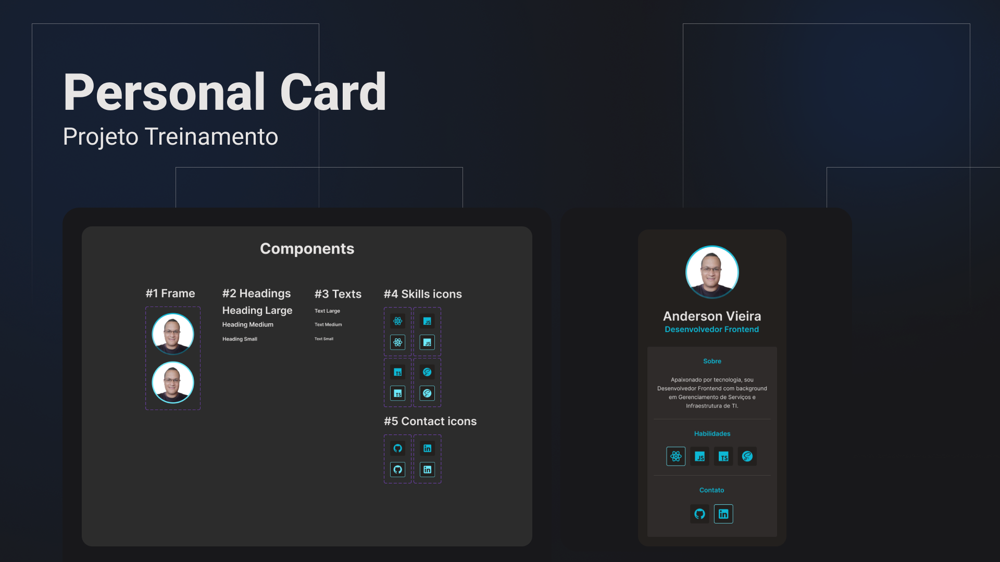

<h1 align="center"> Personal Card </h1>

Projeto pessoal para praticar conhecimentos adquiridos.

  <a href="#Tecnologias">Tecnologias</a>&nbsp;&nbsp;&nbsp;|&nbsp;&nbsp;&nbsp;
  <a href="#Projeto">Projeto</a>&nbsp;&nbsp;&nbsp;|&nbsp;&nbsp;&nbsp;
  <a href="#Layout">Layout</a>&nbsp;&nbsp;&nbsp;|&nbsp;&nbsp;&nbsp;
  <a href="#Aprendizado">O que aprendi</a>

 

  

## Tecnologias

Esse projeto será desenvolvido com as seguintes tecnologias:

- HTML e CSS
- JavaScript e JSON
- [Tailwind CSS](https://tailwindcss.com/)
- [Node e NPM](https://nodejs.org/)
- [Vite](https://vitejs.dev/)
- [React](https://pt-br.reactjs.org/)

## Projeto

O Personal Card é um componente que exibe um resumo das informações profissionais, e direciona para posterior contato através das redes sociais.

## Layout

Utilizei o Figma para construção dos componentes e montagem do layout .

## Aprendizado

Aprimorei meus conhecimentos de Figma para construção de layout organizado através de componentes interativos que simulam sua utilização.

---

Feito por [Anderson Vieira](https://linkedin/in/vieira-a)
