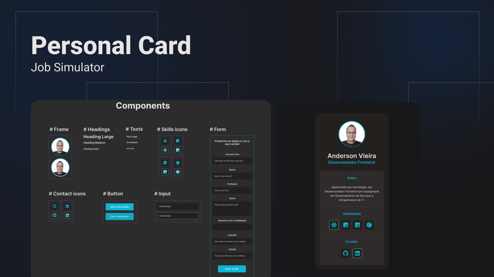

<h1 align="center"> Personal Card </h1>

Projeto pessoal para praticar conhecimentos adquiridos em React JS.

  <a href="#Tecnologias">Tecnologias</a>&nbsp;&nbsp;&nbsp;|&nbsp;&nbsp;&nbsp;
  <a href="#Projeto">Projeto</a>&nbsp;&nbsp;&nbsp;|&nbsp;&nbsp;&nbsp;
  <a href="#Layout">Layout</a>&nbsp;&nbsp;&nbsp;|&nbsp;&nbsp;&nbsp;
  <a href="#Aprendizado">O que aprendi</a>

 

  

## Tecnologias

Esse projeto será desenvolvido com as seguintes tecnologias:

- HTML e CSS
- JavaScript e JSON
- [Tailwind CSS](https://tailwindcss.com/)
- [Node e NPM](https://nodejs.org/)
- [Vite](https://vitejs.dev/)
- [React](https://pt-br.reactjs.org/)

## Projeto

O Personal Card é um componente que exibe um resumo das informações profissionais, e direciona para posterior contato através das redes sociais.
### Requisitos funcionais

- O usuário poderá visualizar um cartão de apresentação padrão conforme especificações de layout;
- O usuário poderá criar o seu próprio cartão preenchendo um formulário com os requisitos;
- O usuário poderá exportar o cartão em formato PDF ou PNG.

## Desenvolvimento
### Sprint 1: Construção do cartão padrão
Inicio: 24/10/2022 | Fim: 31/10/2022

**Tarefas**
- [x] Inicializar projeto
  - [x] Configurar arquivos iniciais e instalar dependências
  - [x] Construir README
- [x] Criar componente Header contendo foto, nome e cargo
- [x] Criar componente Main contendo informações sobre a pessoa do cartão
- [x] Criar componente Skills contendo ícones representantes das habilidades
- [x] Criar componente Contact com ícones representantes dos contatos

### Sprint 2: Construção do cartão padrão
Inicio: 31/10/2022 | Fim: 07/11/2022

**Tarefas**
- [x] Criar componentes de formulário para entrada de dados do usuário

### Sprint 3: Construção do cartão padrão
Inicio: 07/11/2022 | Fim: 14/11/2022

- [x] Separar componentes CardDefault (cartão padrão) e CardCreate (cartão criado pelo usuário)
- [x] Criar componente multi seletor para que o usuário possa selecionar suas skills

### Sprint 4: Construção do cartão padrão
Inicio: 21/11/2022 | Fim: 28/11/2022
- [x] Fazer com que o form inicialize escondido e surja em formato de modal quando o botão "Criar seu cartão" for acionado
- [x] Implementar botão para fechar a criação de novo cartão e retornar ao cartão padrão
- [ ] Criar funções para armazenar dados de entrada e gerar cartão customizado

## Layout

Utilizei o Figma para construção dos componentes e montagem do layout .

## Aprendizado

Aprimorei meus conhecimentos de Figma para construção de layout organizado através de componentes interativos que simulam sua utilização.

---

Feito por [Anderson Vieira](https://linkedin/in/vieira-a)
